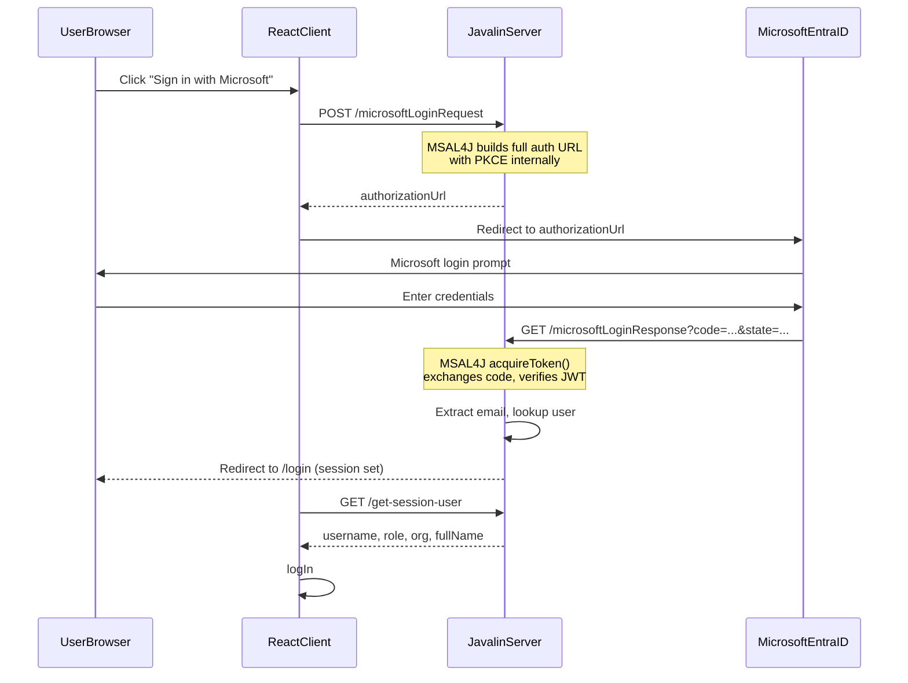

# Microsoft Login Integration (using MSAL4J SDK)

## How it works

Microsoft publishes **MSAL4J** (`com.microsoft.azure:msal4j`), the Java equivalent of the `google-api-client` library already used for Google login. It handles building the authorization URL, PKCE, exchanging the auth code for tokens, and verifying the ID token (including cryptographic signature verification against Microsoft's public keys). The user lookup remains `userDao.getByEmail(email)`.



## What MSAL4J handles for you (vs manual approach)

- **PKCE generation and verification** -- no need for your own `PKCEUtil` calls
- **Authorization URL construction** -- `getAuthorizationRequestUrl()` builds the full Microsoft URL
- **Token exchange** -- `acquireToken(AuthorizationCodeParameters)` POSTs to Microsoft's token endpoint
- **ID token signature verification** -- validates against Microsoft's rotating public keys automatically
- **Claims extraction** -- `result.account().username()` gives the email, `result.idToken()` gives all claims

## Pre-requisite: Azure App Registration

Register an app in the [Azure Portal](https://portal.azure.com) > "Microsoft Entra ID" > "App registrations":

- **Supported account types**: "Accounts in any organizational directory and personal Microsoft accounts" (uses `/common/` tenant)
- **Platform**: Web
- **Redirect URIs**:
  - `http://localhost:7001/microsoftLoginResponse` (dev)
  - `https://staging.keep.id/microsoftLoginResponse`
  - `https://server.keep.id/microsoftLoginResponse`
- **Client secret**: Generate under "Certificates & secrets"
- Note the **Application (client) ID** and the **client secret value**

## Server Changes (Java -- keepid_server)

### 1. Add MSAL4J dependency to pom.xml

Add to [pom.xml](keepid_server/pom.xml):

```xml
<dependency>
    <groupId>com.microsoft.azure</groupId>
    <artifactId>msal4j</artifactId>
    <version>1.24.0</version>
</dependency>
```

### 2. New message enums

Create two enums mirroring Google's pattern:

- `src/main/User/MicrosoftLoginRequestMessage.java` -- same structure as [GoogleLoginRequestMessage.java](keepid_server/src/main/User/GoogleLoginRequestMessage.java) (`REQUEST_SUCCESS`, `INTERNAL_ERROR`, `INVALID_REDIRECT_URI`, `INVALID_ORIGIN_URI`)
- `src/main/User/MicrosoftLoginResponseMessage.java` -- same structure as [GoogleLoginResponseMessage.java](keepid_server/src/main/User/GoogleLoginResponseMessage.java) (`AUTH_SUCCESS`, `AUTH_FAILURE`, `USER_NOT_FOUND`, `INTERNAL_ERROR`)

### 3. New service: ProcessMicrosoftLoginRequestService

- File: `src/main/User/Services/ProcessMicrosoftLoginRequestService.java`
- Validates redirect/origin URIs (same as Google's)
- Uses MSAL4J to build the authorization URL:

```java
ConfidentialClientApplication app = ConfidentialClientApplication
    .builder(clientId, ClientCredentialFactory.createFromSecret(clientSecret))
    .authority("https://login.microsoftonline.com/common/")
    .build();

String authUrl = app.getAuthorizationRequestUrl(
    AuthorizationRequestUrlParameters
        .builder(redirectUri, Set.of("openid", "email", "profile"))
        .responseMode(ResponseMode.QUERY)
        .state(csrfToken)
        .build()
).toString();
```

- Returns the full `authorizationUrl` and `state` (CSRF token) to the client
- **Simpler than Google's version** -- no need to manually generate PKCE challenge/verifier (MSAL4J handles it)
- Still generates a CSRF `state` token for validation on callback

### 4. New service: ProcessMicrosoftLoginResponseService

- File: `src/main/User/Services/ProcessMicrosoftLoginResponseService.java`
- Uses MSAL4J to exchange the authorization code for tokens:

```java
IAuthenticationResult result = app.acquireToken(
    AuthorizationCodeParameters
        .builder(authCode, new URI(redirectUri))
        .scopes(Set.of("openid", "email", "profile"))
        .build()
).get();

String email = result.account().username();
// Parse result.idToken() for name claims if needed
```

- MSAL4J automatically verifies the token signature, issuer, audience, and expiry
- Looks up user by email: `userDao.getByEmail(email)` (same as Google)
- Extracts `name`/`given_name`/`family_name` from the ID token claims for the USER_NOT_FOUND pre-fill case
- Records login activity + history (same as Google)

**Important**: The same `ConfidentialClientApplication` instance (or a fresh one with the same config) must be used for both the request and response phases. MSAL4J manages PKCE internally within the app instance.

### 5. Update UserController.java

- File: [src/main/User/UserController.java](keepid_server/src/main/User/UserController.java)
- Add two new handlers mirroring the Google handlers (lines 186-247):
  - `microsoftLoginRequestHandler` -- calls `ProcessMicrosoftLoginRequestService`, stores `state` + `origin_uri` + `redirect_uri` in session, returns `authorizationUrl` and `state` to client
  - `microsoftLoginResponseHandler` -- validates CSRF state, calls `ProcessMicrosoftLoginResponseService`, sets session attributes on success, stores `microsoftLoginError` on failure, redirects to origin + `/login`

### 6. Update AppConfig.java

- File: [src/main/Config/AppConfig.java](keepid_server/src/main/Config/AppConfig.java)
- Add two routes alongside the Google ones:

```java
app.post("/microsoftLoginRequest", userController.microsoftLoginRequestHandler);
app.get("/microsoftLoginResponse", userController.microsoftLoginResponseHandler);
```

### 7. Update URIUtil.java

- File: [src/main/Security/URIUtil.java](keepid_server/src/main/Security/URIUtil.java)
- Add Microsoft redirect URIs to `isValidRedirectURI()`:

```java
|| redirectUri.equals("http://localhost:7001/microsoftLoginResponse")
|| redirectUri.equals("https://staging.keep.id/microsoftLoginResponse")
|| redirectUri.equals("https://server.keep.id/microsoftLoginResponse")
```

### 8. Update getSessionUser handler

- In [UserController.java](keepid_server/src/main/User/UserController.java) line 249, add a block for `microsoftLoginError` (parallel to the existing `googleLoginError` block)

### 9. Environment variables

- Add `MICROSOFT_CLIENT_ID` and `MICROSOFT_CLIENT_SECRET` to `.env` and `docker-compose.yml`

## Client Changes (React -- keepid_client)

### 10. New component: MicrosoftLoginButton.tsx

- File: `src/components/UserAuthentication/MicrosoftLoginButton.tsx`
- **Simpler than GoogleLoginButton** because the server now returns the full `authorizationUrl` (the client doesn't need to construct it):

```tsx
const handleClick = () => {
  fetch(`${getServerURL()}/microsoftLoginRequest`, {
    method: 'POST',
    credentials: 'include',
    body: JSON.stringify({ redirectUri, originUri }),
  })
    .then(res => res.json())
    .then(data => {
      if (data.status === 'REQUEST_SUCCESS' && data.authorizationUrl) {
        sessionStorage.setItem('microsoftRedirecting', 'true');
        window.location.href = data.authorizationUrl;
      }
    });
};
```

- Uses Microsoft logo and "Sign in with Microsoft" branding
- On mount, checks `sessionStorage.getItem('microsoftRedirecting')` and calls `handleMicrosoftLoginSuccess` (same pattern as Google)

### 11. Update LoginPage.tsx

- File: [src/components/UserAuthentication/LoginPage.tsx](keepid_client/src/components/UserAuthentication/LoginPage.tsx)
- Import and render `<MicrosoftLoginButton>` below the Google button
- Add `handleMicrosoftLoginSuccess` and `handleMicrosoftLoginError` methods (same pattern as Google's, checking `microsoftLoginError` from `/get-session-user`)

### 12. Environment variable (client)

- Add `VITE_MICROSOFT_CLIENT_ID` to `.env` / `.env.development` (used only by the button component if needed, though with MSAL4J the server handles the client ID)

## Complexity Assessment

This is a **moderate** task. Using MSAL4J makes it easier than the Google integration because the SDK handles PKCE, token exchange, and JWT verification. The architecture already supports multi-provider OAuth. Most work is creating parallel copies of the Google services/components with MSAL4J calls replacing the manual Google HTTP logic.